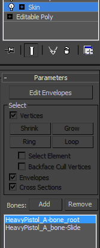
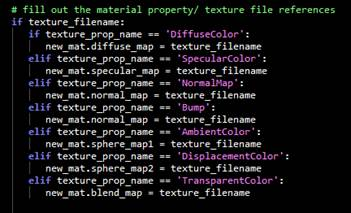
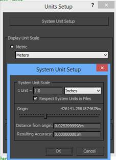
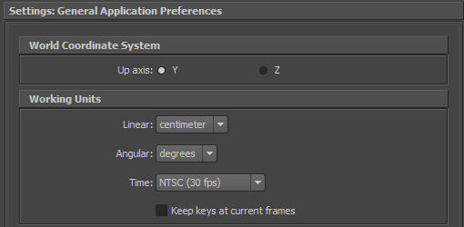
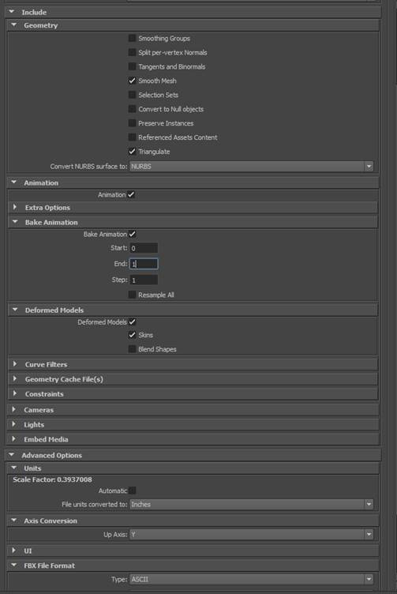
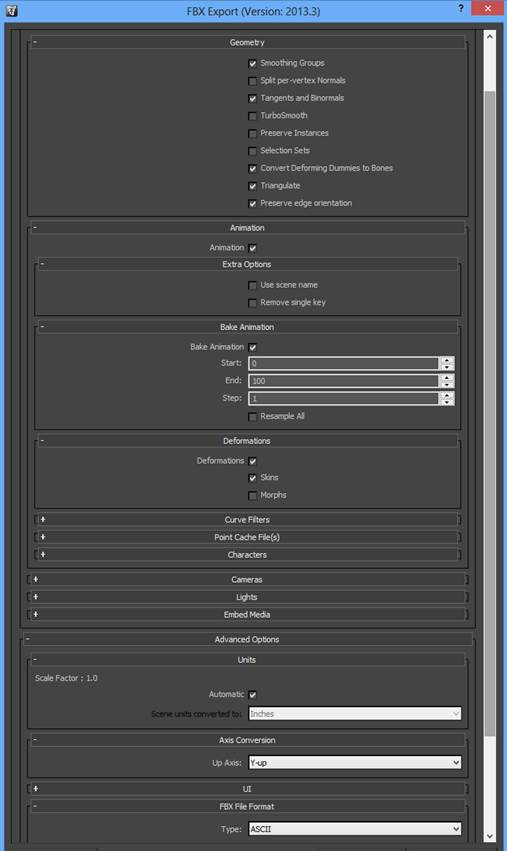
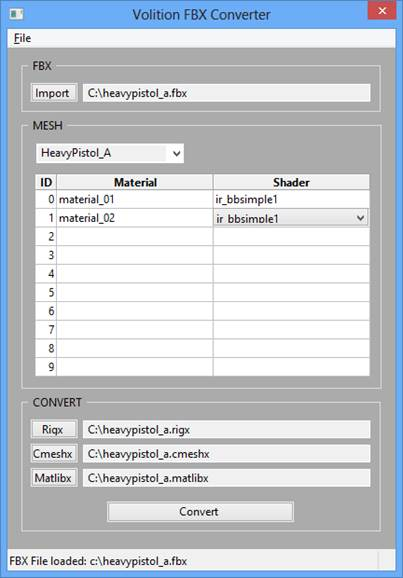

# FBX Converter

These files are used to convert an FBX format file into xml-based files that can be used in the crunch process to bring new assets into SR4.  In addition to this python script, users will need the following external tools:

* [Python 2.6](http://www.python.org/getit/)
* [Wx Python](http://www.wxpython.org/download.php)
* [FBX Python SDK 2014 for Python 2.6](http://usa.autodesk.com/adsk/servlet/pc/item?iteID=123112&id=10775847)

Please make sure that you download the appropriate version of wxPython for the Python distribution that is installed on your machine.

# Creating your Mesh

## Skinning and Bones

Your mesh must have a skin deformer with skin weighted bones to be properly
converted.

There are attributes which I will have to outline later for ordering the bones
but for now a default hierarchy with a **single** parent root node should be
handled properly.

## Attachment Tags

Weapons and Characters have dummy objects used to define fx or attachment
locations. These dummy or null objects **must** be children of bones found in
the skin clusters. The tags must either have a “p_tag_name” custom attribute
or a “$prop-” name prefix. We can update the prefix name to better suit DCC
applications that don’t care for special characters in the name. Weapons have
the following tags.

_Must Have_

“weapon_handle” – where it attaches to the hand of a character

“secondary_handle” – where the offhand will ik attach to the weapon

“muzzle_flash” – where the muzzle flash fx will play from

_Optional Per Weapon_

“attach” – attach to character position ( On the back of a character etc )

“gunmag_handle” – clip attachment position

“vfx(1-x)”

“shell_eject”

“shell_eject(1-x)”

“weapon_center”

“weapon_impact” – hit location of the weapon when used in melee attach

“weapon_impact(1-x)”

## Materials & Textures

You should place all of your textures in the same folder location you plan to
export the FBX file to. When the material is written out to our format the
textures assigned to specific material attributes in the DCC app will get
slotted as follows. So make sure the appropriate texture is assigned to the
proper material attribute.

Sphere maps are shaderball textures used for a custom ShaderBall shader. More
details should come on setting this material up later.

**Start with assigning Simple1 or Simple3 in the FBX Converter**

## 3dsmax Units Setup

If you are working in 3dsmax you should set your units to the following.

## Maya Units Setup

If you are working in Maya you should adjust your settings to the following.

# Exporting

Follow the FBX export templates provided here to export your mesh from the DCC
application. The main settings to be aware of are the “Units” and “Up Axis”.

### Specifically

Units = Inches

Up Axis = Y-up

**MAYA FBX EXPORT SETTINGS**

****

** **

**3dsMax FBX EXPORT SETTINGS**

**Using the FBX Converter**

1\. Import FBX file

2\. The main skinned mesh should be selected by default, if not select that to
get the proper results

3\. Double-click and assign SR shader to each material found on the mesh

4\. Hit the check button for each file type to convert/create.

·         The output file locations are automatically set to the source FBX
file location. This should probably not change.

5\. Hit Convert

·         Additional files will default to being generated in the same
location as the source FBX file.

